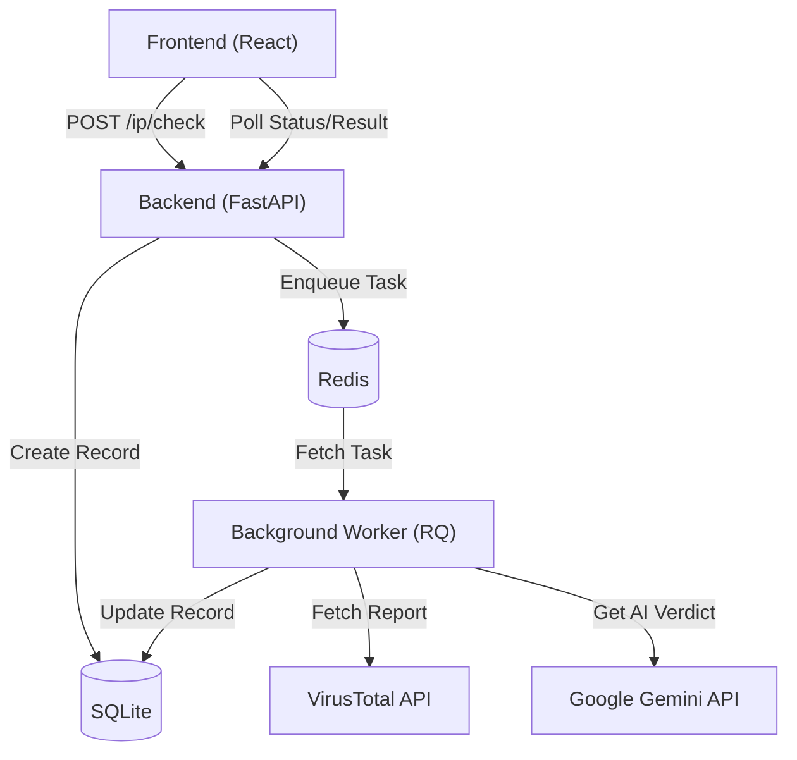

# 🛡️ IP Verification Platform

A modern, full-stack application for automated IP address security analysis. This platform leverages FastAPI, React, and AI-driven insights to provide comprehensive security verdicts for any IP address.

---

## 🏗️ Architecture

The system is built with a distributed architecture to handle time-consuming API lookups asynchronously.



## 🚀 Key Features

- **Asynchronous Processing**: High-performance background task execution using Redis and RQ.
- **Deep Security Analysis**: Integration with **VirusTotal** for historical reputation data.
- **AI-Powered Verdicts**: Uses **Google Gemini 2.5 Flash** to analyze raw security data and provide human-readable risk assessments.
- **Modern UI**: A sleek, responsive React interface built with TypeScript and Vite.
- **Developer First**: Fully containerized with Docker, type-checked, and linted.

## 🛠️ Tech Stack

### Backend
- **Framework**: FastAPI (Python 3.12+)
- **ORM**: Peewee (SQLite)
- **Task Queue**: Redis & RQ (Redis Queue)
- **Dependencies**: Poetry

### Frontend
- **Framework**: React 18
- **Language**: TypeScript
- **Build Tool**: Vite
- **Styling**: Tailwind CSS / Custom Glassmorphism

---

## 🚦 Getting Started

### Prerequisites
- [Docker](https://docs.docker.com/get-docker/)
- [Docker Compose](https://docs.docker.com/compose/install/)

### Environment Setup

1. **Clone the repository**:
   ```bash
   git clone https://github.com/janos-gonye/eo-py-coding-challenge.git
   cd eo-py-coding-challenge
   ```

2. **Configure Environment Variables**:
   Copy the example environment file and add your API keys:
   ```bash
   cp .env.example .env
   ```
   Edit `.env` and provide your credentials for:
   - `APP_API_KEY_VIRUSTOTAL`
   - `APP_API_KEY_GEMINI`

### Running the Project

Build and start all services (API, Worker, Redis, and UI):

```bash
docker compose up --build -d
```

- **Backend API**: [http://localhost:8000](http://localhost:8000)
- **Interactive API Docs**: [http://localhost:8000/docs](http://localhost:8000/docs)
- **User Interface**: [http://localhost:5173](http://localhost:5173)

---

## 👨‍💻 Development

### Project Structure
```text
.
├── public_api/          # FastAPI application & Background Worker
│   ├── src/             # Core logic, models, and tasks
│   ├── tests/           # Server-side test suite
│   ├── data/            # Local SQLite storage (persistent)
│   └── scripts.py       # Development utility scripts
├── user_interface/      # React frontend
│   ├── src/             # Components and application logic
│   └── tests/           # Client-side test suite
└── docker-compose.yaml  # Service orchestration
```

### Essential Commands

| Task | Command |
| :--- | :--- |
| **Server Tests** | `docker compose exec public-api poetry run pytest -svv` |
| **Client Tests** | `docker compose exec user-interface npx vitest run` |
| **Lint Backend** | `docker compose exec public-api poetry run python scripts.py lint` |
| **Format Backend**| `docker compose exec public-api poetry run python scripts.py format` |
| **Lint Frontend** | `docker compose exec user-interface npm run lint` |

---

## 📄 License

This project is released under the MIT License.
